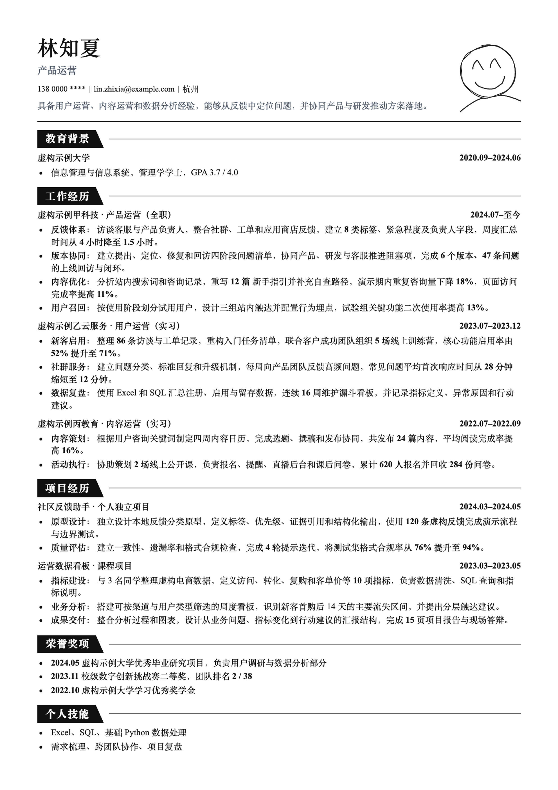
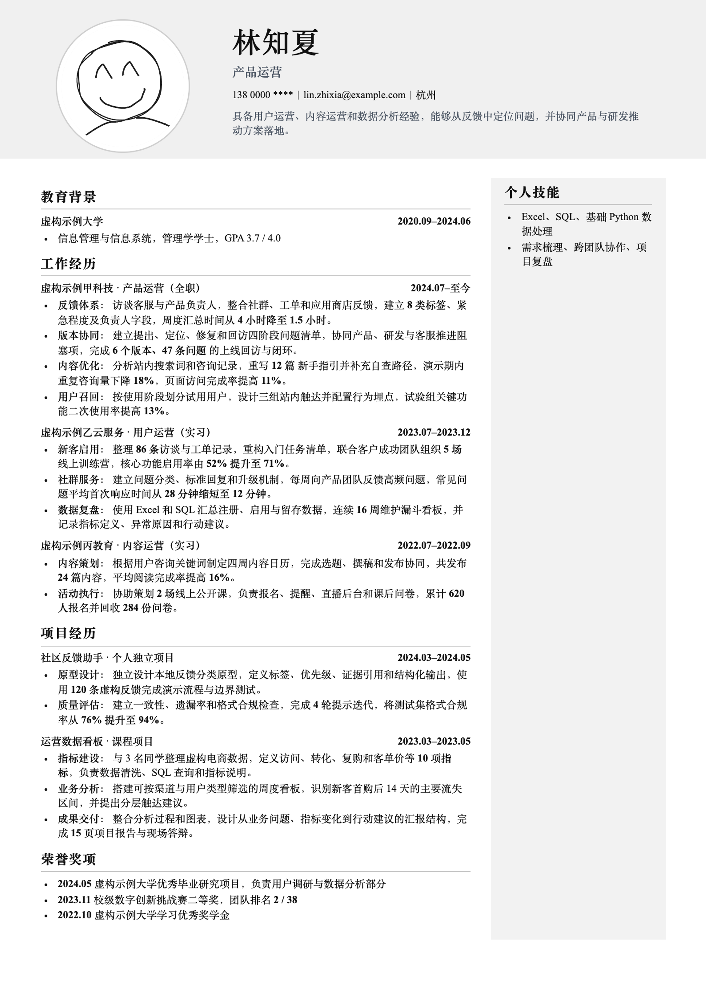
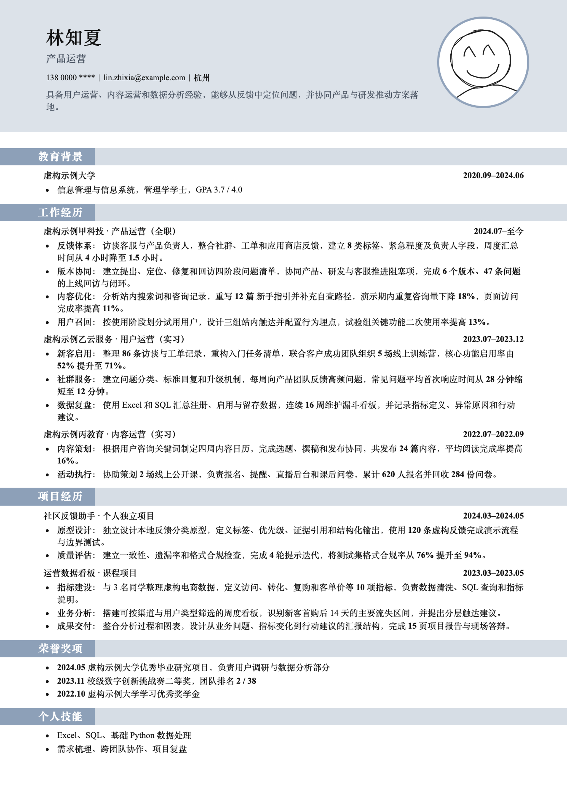

# 简历工作流

用 Codex、Claude Code、OpenCode 或 WorkBuddy 整理自己的经历，根据招聘要求定制简历，再排版导出 PDF。旧简历里的内容先由你确认，AI 才能用于新简历。

## 第一次使用

1. **打开项目**：下载并解压整个仓库，在你使用的 AI 工具中打开这个文件夹。工具设置见[安装与使用](使用说明/安装与使用.md)。
2. **放入旧简历**：把 PDF、Word、图片或文字材料放到[原始材料](原始材料/README.md)，也可以直接在对话中提供。
3. **整理并确认经历**：对 AI 说：“把原始材料中的旧简历整理成候选事实，列出需要我确认的问题。”确认后的资料会保存在[简历事实库](简历事实库/README.md)。你不需要手动填写文件或内部 ID。
4. **提供招聘要求**：发来岗位描述（JD）的文字或图片，说：“根据这份 JD 修改简历。”AI 会确认目标公司和岗位，再给你 Markdown 草稿。
5. **确认并导出**：检查文案后说：“这版文案确认，请打开编辑器。”按指引安装本地编辑器环境，选择模板，调整排版，导出 PDF 和 PNG。文件保存在[岗位档案](岗位档案/README.md)。

## 文件在哪里

| 想做什么 | 打开哪里 |
|---|---|
| 放旧简历、证书和补充材料 | [原始材料](原始材料/README.md) |
| 查看 AI 整理的本人资料和经历 | [简历事实库](简历事实库/README.md) |
| 找已生成的简历和导出文件 | [岗位档案](岗位档案/README.md) |
| 先看虚构案例或试用排版 | [示例资料](示例资料/_index.md) |
| 查看详细操作与常见问题 | [使用说明](使用说明/README.md) |
| 修改程序、运行测试 | [开发](开发/README.md) |

“简历事实库”是你的经历资料，“岗位档案”是针对具体职位生成的简历。AI 会根据 JD 直接匹配全部已确认事实。下载时本人事实库为空；所有虚构经历都在“示例资料”，不会自动用于真实简历。

正式文件按以下方式保存，日期为 Markdown 首次生成当天的本地日期，修改时沿用原目录：

```text
岗位档案/
└── 2026/
    └── 2026-09-18-公司名称-岗位名称/
        ├── resume.md      文案草稿或终稿
        ├── resume.html    确认后生成的页面文件
        ├── resume.pdf     导出后生成
        └── resume.png     导出后生成
```

## 还能让 AI 做什么

- “根据同一份 JD 写一段求职打招呼。”
- “根据这份 JD 和已确认简历写一段面试自我介绍。”
- “补充一段项目经历，先让我确认事实。”

打招呼和自我介绍在对话中返回，不另外创建文件。未确认的经历不会进入简历。真实资料与输出目录已设置 Git 忽略；分享项目前仍需检查没有附带本人材料。

## 隐私保护

每位下载、Clone 或 Fork 本仓库的使用者都会在自己的本地目录中保存真实资料。以下内容默认受 `.gitignore` 保护，不会进入普通的 `git add` 或 GitHub 提交：

- `原始材料/` 中的旧简历、证书和附件；
- `简历事实库/` 中的事实正文与本地 `_index.md`；
- `岗位档案/` 中的公司、岗位、本地索引、Markdown、HTML、PDF 和 PNG；
- `.resume-workflow/` 中的本地偏好。
- `.workbuddy/` 中 WorkBuddy 在本机生成的任务记忆与配置。

公开仓库只保留 README、`_index.example.md` 和虚构的 `示例资料/`。不要使用 `git add -f` 强制提交私有目录，不要删除相关忽略规则，也不要把真实资料复制到 `示例资料/`。推送前运行 `npm run privacy-check`；该命令会分别检查已跟踪文件和暂存区，并阻断未经复核的二进制文件，再运行 `npm test` 完成其余验证。

## 简历模板

| 经典黑白 | 灰白双栏 | 蓝灰单栏 |
|---|---|---|
|  |  |  |

支持中文单页 A4，导出 PDF 和 2480 × 3508 PNG。编辑器修字和排版保存在当前浏览器会话，关闭后可能丢失，请及时导出。HTML 页面文件不是完整编辑器，具体保存边界见[安装与使用](使用说明/安装与使用.md)。

根目录的 `AGENTS.md`、`CLAUDE.md`、`CODEBUDDY.md` 和隐藏技能目录供 AI 工具读取；`package.json` 与锁文件用于安装编辑器。普通用户无需手动修改它们。

## 授权

代码与文本采用 [MIT License](LICENSE)。示例照片由项目发起人独立创作，采用 [CC BY 4.0](https://creativecommons.org/licenses/by/4.0/deed.zh-hans) 授权，署名与使用方式见[素材说明](示例资料/排版案例/assets/README.md)。
